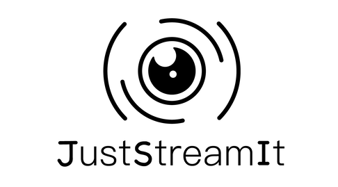

# Oc-P6 Développez une interface utilisateur pour une application web Python
---

## Objectif
Ce programme est un projet proposé par [OpenClassRooms](https://openclassrooms.com/fr/) dans le cadre de la formation :
Développeur d'applications Python. Il s'agit de développer une application Web pour l'association JustStreamIt.

* Le site web présente le film le mieux 
* une liste des 7 meilleurs films 
* une liste des 7 meilleurs films de la catégorie ??
* une liste des 7 meilleurs films de la catégorie ??
* une liste des 7 meilleurs films de la catégorie ??

Un carroussel donne la possibilité de naviguer dans chacune des listes

## Fonctionnement

* Le programme est écrit en html5, css3 et Javascript
* Il utilise une API REST: OCMovies-API-EN-FR

## API OCMovies-API

* Concernant l'installation de l'API, suivez les instructions données dnas le repository Guthub :
[dépôt de OCMovies-API-EN-FR](https://github.com/OpenClassrooms-Student-Center/OCMovies-API-EN-FR)
* Puis lancez le serveur : pipenv run python manage.py runserver

## Installation

* ??? testé sur plusieurs navigateurs
* L'API tourne par défaut sur le port 8000
* Ouvrez le fichier index.html en local depuis votre navigateur favori